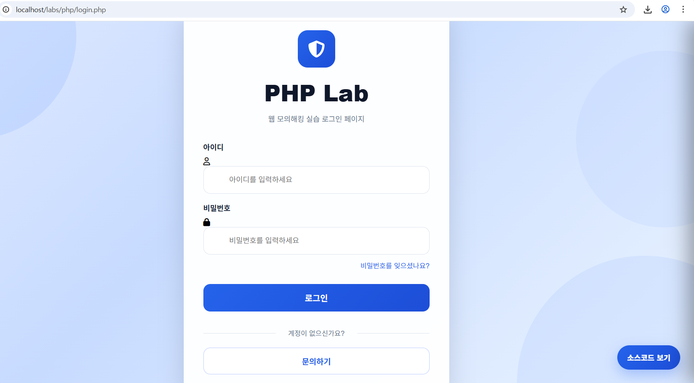
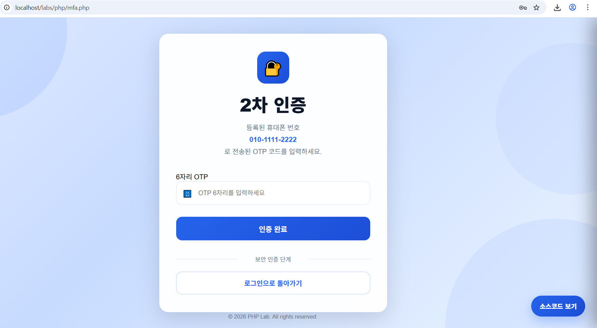
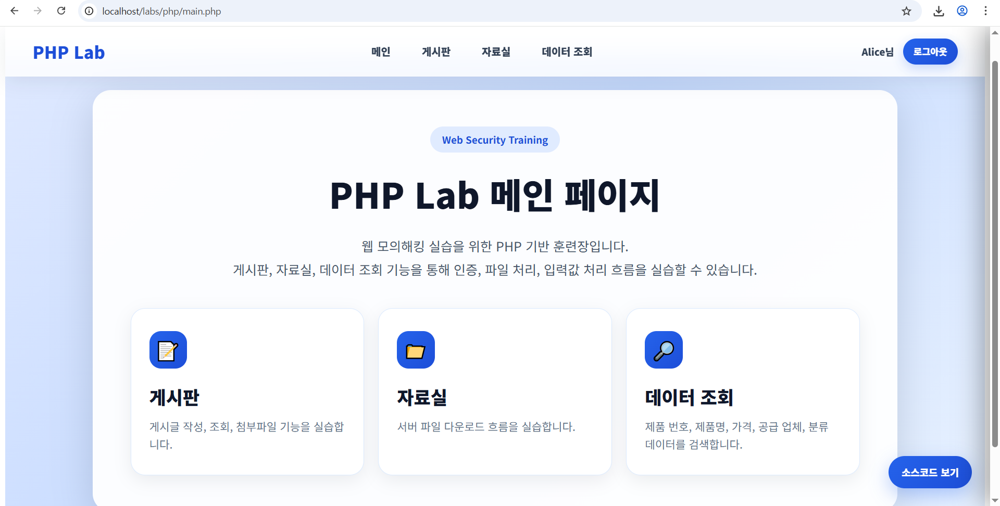
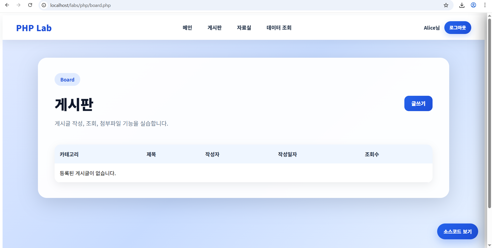
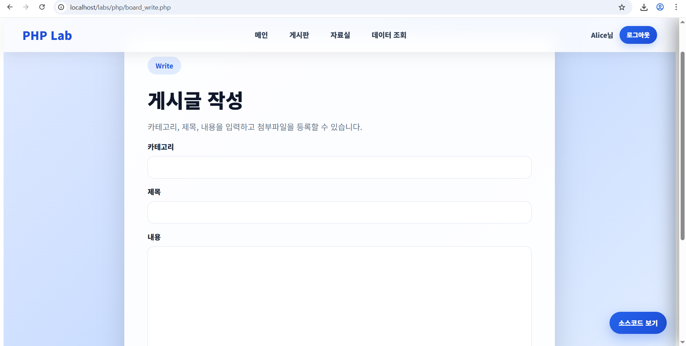
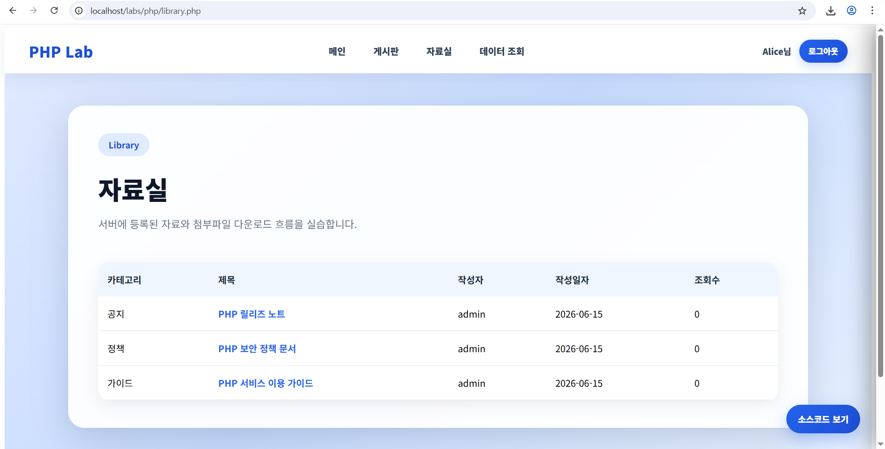
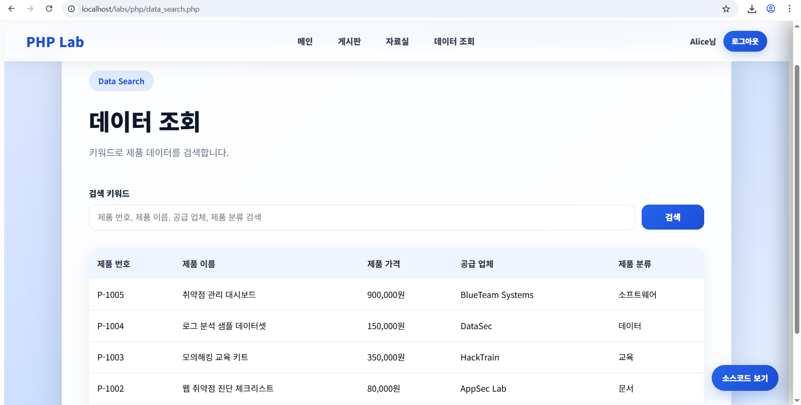

# Web Security Training Lab

PHP 기반의 웹 모의해킹 실습 플랫폼입니다.

실제 웹 서비스와 유사한 UI/UX를 제공하며, 다양한 웹 취약점 분석 및 공격/방어 기법을 학습할 수 있도록 설계되었습니다.

---

## 주요 기능

### 인증(Authentication)

* ID / Password 로그인
* OTP 기반 MFA(2차 인증)
* 세션 기반 사용자 인증 처리
* 로그인 및 인증 흐름 학습 가능

### 게시판(Board)

* 게시글 작성
* 게시글 조회
* 파일 업로드
* 게시글 DB 저장

### 자료실(Library)

* 파일 다운로드 기능
* 서버 저장 파일 조회
* 다운로드 처리 로직 분석 가능

### 데이터 조회(Data Search)

* 제품 데이터 검색
* MySQL 연동
* 검색 기능 구현

### 소스코드 보기

각 페이지에서 "소스코드 보기" 버튼을 통해 해당 기능의 백엔드 소스코드를 확인할 수 있습니다.

교육 및 분석 목적으로 활용할 수 있습니다.

---

# 실습 가능한 취약점 목록

| 구분                     | 취약점           | 실습 위치                            |
| ---------------------- | ------------- | -------------------------------- |
| Authentication         | MFA 우회        | mfa.php                          |
| Session                | MFA 이전 세션 발급  | login.php                        |
| Injection              | SQL Injection | data_search.php                  |
| XSS                    | Stored XSS    | board_write.php / board_view.php |
| File Upload            | 위험한 파일 업로드    | 게시판 첨부파일                         |
| File Download          | 다운로드 기능 분석    | download.php                     |

※ 현재 버전 기준

---

# 아키텍처

```text
┌────────────────────┐
│      Browser       │
└─────────┬──────────┘
          │
          ▼
┌────────────────────┐
│      Nginx         │
│ Reverse Proxy      │
└─────────┬──────────┘
          │
          ▼
┌────────────────────┐
│     PHP 8.2        │
│     Apache         │
│                    │
│ login.php          │
│ mfa.php            │
│ board.php          │
│ library.php        │
│ data_search.php    │
└─────────┬──────────┘
          │ PDO
          ▼
┌────────────────────┐
│      MySQL 8       │
│                    │
│ users             │
│ board_posts       │
│ library_posts     │
│ products          │
└────────────────────┘
```

---

# 프로젝트 구조

```text
lab-php/
├─ src/
│  ├─ login.php
│  ├─ mfa.php
│  ├─ main.php
│  ├─ board.php
│  ├─ board_write.php
│  ├─ board_view.php
│  ├─ library.php
│  ├─ library_view.php
│  ├─ data_search.php
│  ├─ download.php
│  ├─ source_view.php
│  ├─ layout.php
│  ├─ db.php
│  └─ uploads/
│
├─ db/
│  └─ init.sql
│
└─ Dockerfile
```

---

# 스크린샷

## 로그인



> 로그인 페이지 스크린샷

---

## MFA



> OTP 인증 페이지 스크린샷

---

## 메인



> 메인 대시보드 스크린샷

---

## 게시판



> 게시판 목록 화면

---

## 게시글 작성



> 게시글 작성 화면

---

## 자료실



> 자료실 화면

---

## 데이터 조회



> 데이터 조회 화면

---

# 기술 스택

## Backend

* PHP 8.2
* Apache
* MySQL 8

## Frontend

* HTML5
* CSS3
* JavaScript

## Infrastructure

* Docker
* Docker Compose

---

# 실행 방법

## 1. 프로젝트 실행

```bash
docker compose up --build
```

## 2. 접속

```text
http://localhost/labs/php/login.php
```

---

# 기본 계정

```text
ID  : alice
PW  : alice1234
OTP : 654321
```

```text
ID  : bob
PW  : bob1234
OTP : 123456
```

---

# 향후 추가 예정 기능

* Reflected XSS 실습
* DOM XSS 실습
* CSRF 실습
* Path Traversal 실습
* File Inclusion 실습
* SSRF 실습
* Command Injection 실습
* XXE 실습
* JWT 취약점 실습
* 권한 상승(Privilege Escalation) 실습
* 관리자 페이지 실습
* REST API 취약점 실습
* Docker 기반 다중 언어 실습 환경

  * PHP
  * JSP
  * ASP.NET

---

# 교육 목적

본 프로젝트는 웹 애플리케이션 보안 교육 및 실습을 목적으로 제작되었습니다.

실제 운영 환경에서는 사용하지 않으며, 모든 실습은 격리된 테스트 환경에서 수행해야 합니다.

---

# License

MIT License
